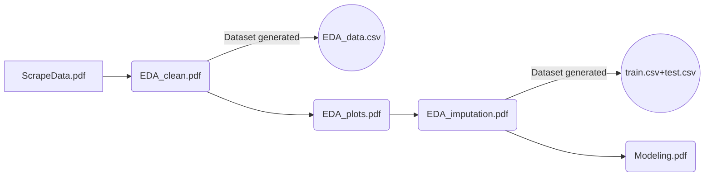

# MA429 Project Group 9

### PDFs for Jupyter Notebooks
We have several pdf files for the Jupyter notebooks used in our project. There are 5 pdf files, namely *ScrapeData.pdf*, *EDA_clean.pdf*, *EDA_plots.pdf*, *EDA_imputation.pdf*, *Modeling.pdf*. 

The reading order can be found below: 

### Files: 

- **data**: The data used in this project.
- *scrape_data.ipynb*: Jupyter notebook of python scripts used to collect data.
- *EDA_part1.ipynb*, *EDA_plot.ipynb*, *EDA_part2.ipynb*: Jupyter notebook used to do EDA.
- *MY_Models.py*: Python script implementing the machine learning model.
- *Modeling_all.ipynb*: Jupyter notebook used to train models and get the results.

