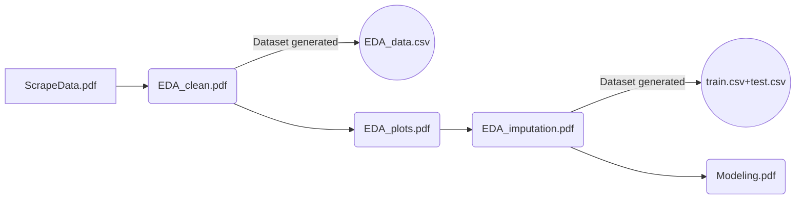

# MA429 Project Group 9

This project presents the findings of a regression analysis conducted to predict the flight tickets fare based on 18 pre-processed flight information features. The dataset used in this report was scraped from a publicly available source on different dates to ensure variability. Data pre-processing and feature engineering is conducted in preparation for model training. 4 models (XGBoost, Neural Network, Auto-encoder + XGBoost, and XGBoost + Neural Network) are developed through 5 fold cross-validation and hyperparameter tuning, and evaluated using various performance metrics such as R^2, MSE, MAE and MAPE. Test set is left untouched during training process until final evaluation, from which, Auto-encoder + XGBoost model performs the best. Robustness test (on future data) is also conducted to ensure the reliability of the model and its predicting power under a range of scenarios and conditions. Complete process is like: 

### PDFs for Jupyter Notebooks
We have several pdf files for the Jupyter notebooks used in our project. There are 5 pdf files, namely *ScrapeData.pdf*, *EDA_clean.pdf*, *EDA_plots.pdf*, *EDA_imputation.pdf*, *Modeling.pdf*. 

The reading order can be found below: 

### Files: 

- **data**: The data used in this project.
- *scrape_data.ipynb*: Jupyter notebook of python scripts used to collect data.
- *EDA_part1.ipynb*, *EDA_plot.ipynb*, *EDA_part2.ipynb*: Jupyter notebook used to do EDA.
- *MY_Models.py*: Python script implementing the machine learning model.
- *Modeling_all.ipynb*: Jupyter notebook used to train models and get the results.

